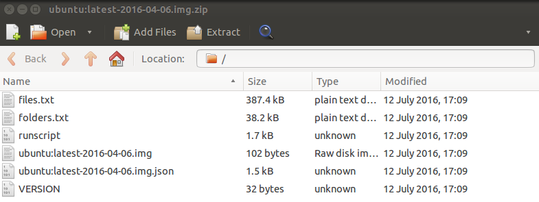

# Package your container

A package is a zipped up file that contains the image, the singularity runscript as `runscript`, a [boutique schema descriptor](https://github.com/boutiques/schema) with acceptable input arguments, a `VERSION` file, and a list of files `files.txt` and folders `folders.txt` in the container. 

The reason to create this package is that a higher level application might want to extract meta data about the container without needing to mount it. 

  - files.txt and folders.txt: are simple text file lists with paths in the container, and this choice is currently done to provide the rawest form of the container contents. 
  - VERSION: is a text file with one line, an md5 hash generated for the image when it was packaged. This version is also included with the boutiques schema. This is to ensure that the meta data about an image matches the current image, to the best of our knowledge.
   - {{image}}.img: is of course the original singularity container (usually a .img file)
   - {{image}}.json: is the boutiques schema describing the inputs ([more detail here](examples/package_image))

## Walk through an example

I've provided a sample image with a python runscript that uses `argparse` to generate input args, and thus conforms to our current standard that this tool can parse. If you want to generate your own template, there are instructions under [make_runscript](../make_runscript).

First, download this image:

      wget http://www.vbmis.com/bmi/project/singularity/package_image/ubuntu:latest-2016-04-06.img
      ls
      ubuntu:latest-2016-04-06.img
      

You can now use the `shub` command line tool to package your image. Note that you must have [singularity installed](https://singularityware.github.io/#install), and depending on the function you use, you will likely need to use sudo. We can use the `--package` argument to package our image:

      shub --image ubuntu:latest-2016-04-06.img --package

If no output folder is specified, the resulting image (named in the format `ubuntu:latest-2016-04-06.img.zip` will be output in the present working directory. You can also specify an output folder:

      shub --image ubuntu:latest-2016-04-06.img --package --outfolder /home/vanessa/Desktop

For the package command, you will need to put in your password to grant sudo priviledges, as packaging requires using the singularity `export` functionality.

      $ shub --package --image ubuntu\:latest-2016-04-06.img 
      Found Singularity version 2.1

      [sudo] password for vanessa: blargblargblarg
      Generating unique version of image (md5 hash)
      Found runscript!
      Adding --integer input to spec...
      Adding --boolean input to spec...
      Adding --string input to spec... 
      Extracted runscript params!
      Adding software list to package!
      Adding files.txt to package...
      Adding ubuntu:latest-2016-04-06.img.json to package...
      Adding VERSION to package...
      Adding ubuntu:latest-2016-04-06.img to package...
      Adding runscript to package...
      Adding folders.txt to package...
      Package created at /home/vanessa/Desktop/ubuntu:latest-2016-04-06.img.zip

### Inspecting the outputs

#### ubuntu:latest-2016-04-06.img

This is the original image. It will be extracted from the zip and saved to singularity-hub equivalently to an image uploaded that is not packaged. The main difference in providing the image in a package is that it brings rich meta data about inputs, software included, and versioning.

#### VERSION

The `VERSION` file is a simple text file that is an md5 hash of the container/image when it was packaged. This is important for applications / future use to ensure that the meta-data in the package is associated with the correct image. If you look at the boutiques json specified next, you will see that we store this VERSION there as well.

      4b315329b7f8b18799bb8c68def515e8

#### runscript

This is the runscript, meaning the `/singularity` file extracted from the container, if one is provided. This will be provided in the application for the user to easily see, and is also useful to have it available for applications so they do not need to mount the container.

#### ubuntu:latest-2016-04-06.img.json

This is the boutiques spec, and largely it will store the parsed input options. The schema requires specification of an output, but in this format I don't have a good idea for how to get that yet. Since the user will be manually generating workflows (click click!) using singularity hub, for now we will require him/her to specify the output types when uploading the package. In the future it would be ideal to have an improved solution for this, such as a testing suite (a node on SLURM cluster, for example) where an analysis component can be packaged, and outputs can be determined based on files generated after the job is completed.

      {'command-line': 'ubuntu:latest-2016-04-06.img [INTEGER] [BOOLEAN] [STRING] ',
       'description': 'ubuntu:latest-2016-04-06.img is a singularity container that can be integrated into a workflow.',
       'inputs': [{'command-line-flag': '--integer',
         'command-line-key': '[INTEGER]',
         'default-value': 9999,
         'description': 'This is a string argument with default None',
         'id': 'integer',
         'list': False,
         'name': 'integer',
         'optional': False,
         'type': 'Number'},
        {'command-line-flag': '--boolean',
         'command-line-key': '[BOOLEAN]',
         'default-value': False,
         'description': 'This is a boolean argument that defaults to False, and when set, returns True',
         'id': 'boolean',
         'list': False,
         'name': 'boolean',
         'optional': False,
         'type': 'String'},
        {'command-line-flag': '--string',
         'command-line-key': '[STRING]',
         'description': 'This is a string argument with default None',
         'id': 'string',
         'list': False,
         'name': 'string',
         'optional': False,
         'type': 'String'}],
       'name': 'ubuntu:latest-2016-04-06.img',
       'outputs': [],
       'schema-version': '0.2-snapshot',
       'tool-version': '4b315329b7f8b18799bb8c68def515e8'}

This data structure is going to be parsed by the (under development) [singularity-hub](https://github.com/singularityware/singularity-hub) to get the user (most of the way) to having things like inputs programatically determined.
